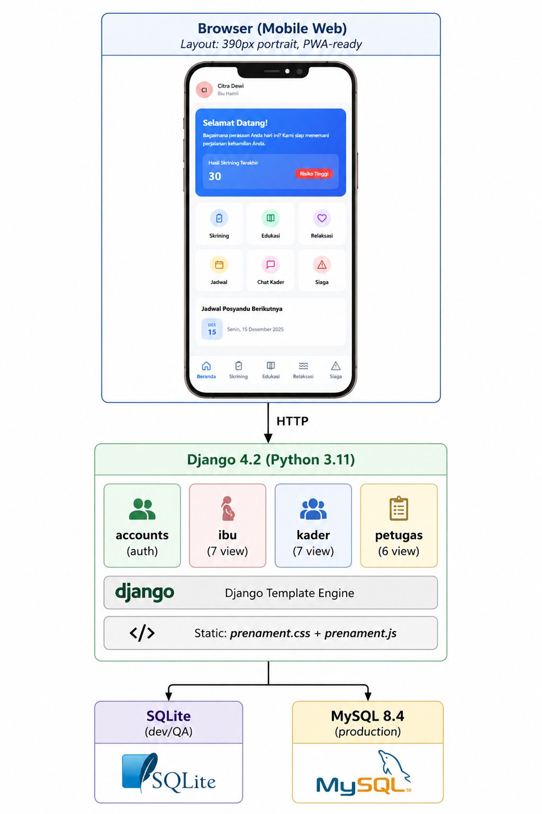

# PRENAMENT — Sahabat Kesehatan Mental Ibu Hamil di Era Digital

> Aplikasi web mobile-first berbasis Django untuk pemantauan kesehatan mental ibu hamil di Puskesmas Lansot, Kota Tomohon.

---

## Daftar Isi

1. [Tentang Aplikasi](#1-tentang-aplikasi)
2. [Fitur Lengkap](#2-fitur-lengkap)
3. [Arsitektur & Tech Stack](#3-arsitektur--tech-stack)
4. [Struktur Proyek](#4-struktur-proyek)
5. [Persyaratan Sistem](#5-persyaratan-sistem)
6. [Instalasi & Setup (SQLite — Development)](#6-instalasi--setup-sqlite--development)
7. [Instalasi & Setup (MySQL — Production dengan Laragon)](#7-instalasi--setup-mysql--production-dengan-laragon)
8. [Seed Data Demo](#8-seed-data-demo)
9. [Akun Default & Cara Login](#9-akun-default--cara-login)
10. [Panduan URL & Navigasi](#10-panduan-url--navigasi)
11. [Peran Pengguna (Role-Based Access)](#11-peran-pengguna-role-based-access)
12. [Model Database](#12-model-database)
13. [Konfigurasi Settings](#13-konfigurasi-settings)
14. [Menjalankan Server](#14-menjalankan-server)
15. [Admin Django](#15-admin-django)
16. [Migrasi Database](#16-migrasi-database)
17. [Troubleshooting](#17-troubleshooting)
18. [Deployment ke Production](#18-deployment-ke-production)

---

## 1. Tentang Aplikasi

**PRENAMENT** adalah platform digital kesehatan mental ibu hamil yang dibangun khusus untuk Puskesmas Lansot, Kota Tomohon. Aplikasi ini menghubungkan tiga pemangku kepentingan:

| Peran | Deskripsi |
|-------|-----------|
| **Ibu Hamil** | Melakukan skrining mandiri, membaca edukasi, latihan relaksasi, dan mempersiapkan persalinan |
| **Kader Posyandu** | Memantau ibu hamil di wilayahnya, mengelola jadwal kegiatan, dan membuat laporan |
| **Petugas Puskesmas** | Mengelola seluruh pengguna, artikel edukasi, dan statistik wilayah |

**Skrining yang digunakan:** PRAQ-R2 (Pregnancy-Related Anxiety Questionnaire — Revised 2) — kuesioner tervalidasi untuk mengukur kecemasan ibu hamil.

**Bahasa antarmuka:** Bahasa Indonesia
**Format tampilan:** Mobile-first (lebar 390px, orientasi portrait, seperti Android)

---

## 2. Fitur Lengkap

### Ibu Hamil (7 Halaman)

| Halaman | Fitur |
|---------|-------|
| **Beranda** | Sambutan, skor skrining terakhir, kategori risiko, jadwal dari kader |
| **Skrining** | Kuesioner PRAQ-R2 (4 pertanyaan, skala 0-4), riwayat 3 skrining terakhir |
| **Hasil Skrining** | Skor total, kategori risiko (Rendah/Sedang/Tinggi), riwayat historis |
| **Edukasi** | Artikel kesehatan mental dengan filter 6 kategori, konten baca penuh |
| **Relaksasi** | 4 latihan audio (pernapasan, relaksasi otot, body scan, visualisasi), 6 afirmasi harian |
| **Siaga Bencana** | 5-item checklist kesiapan persalinan, dapat dicentang/uncentang |
| **Profil** | Edit nama, usia, alamat, usia kehamilan, status paritas |

### Kader Posyandu (7 Halaman)

| Halaman | Fitur |
|---------|-------|
| **Beranda** | Total ibu binaan, jumlah risiko tinggi, daftar perhatian khusus, jadwal terdekat |
| **Daftar Ibu** | Semua ibu hamil dalam wilayah kader, dengan usia kehamilan |
| **Monitor** | Daftar skor terurut, analisis tren (naik/turun/stabil), persentase dari skor max |
| **Detail Ibu** | Profil lengkap, riwayat 5 skrining terakhir, skor terakhir dan kategori risiko |
| **Jadwal** | CRUD jadwal kegiatan (tambah/hapus), dengan tanggal, waktu, dan venue |
| **Laporan** | Pie chart distribusi risiko (SVG), total skrining, rata-rata skor |
| **Profil** | Edit nama, nama posyandu, wilayah |

### Petugas Puskesmas (6 Halaman)

| Halaman | Fitur |
|---------|-------|
| **Beranda** | Dashboard: total ibu, total kader, ibu risiko tinggi, total skrining, rata-rata skor |
| **Manajemen Pengguna** | Tab Ibu/Kader, pencarian nama, tampilkan kategori risiko |
| **Statistik** | Bar chart tren skrining 6 bulan (SVG), breakdown per wilayah/kader |
| **Artikel** | CRUD artikel edukasi: buat, edit, hapus, toggle publikasi |
| **Profil** | Edit nama, NIP, nama puskesmas, jabatan |

---

## 3. Arsitektur & Tech Stack



**Backend:** Django 4.2, Python 3.11
**Database:** SQLite (development) / MySQL 8.4 (production via Laragon)
**Frontend:** Django Templates, CSS custom (mobile-first, tanpa framework CSS eksternal)
**Auth:** Custom User Model berbasis `AbstractUser` dengan field `role`
**Session:** Cookie-based, 24 jam
**PWA:** Web App Manifest + Service Worker (`sw.js`)

---

## 4. Struktur Proyek

```
django_app/
├── manage.py                    # Entry point Django CLI
├── requirements.txt             # Dependensi Python
├── setup.py                     # Script setup alternatif (legacy)
├── db.sqlite3                   # Database SQLite (auto-generated)
│
├── prenament/                   # Konfigurasi proyek Django
│   ├── settings.py              # Semua konfigurasi
│   ├── urls.py                  # URL utama (root routing)
│   ├── wsgi.py                  # Entry point WSGI (production)
│   └── asgi.py                  # Entry point ASGI (async)
│
├── accounts/                    # App: autentikasi & manajemen user
│   ├── models.py                # CustomUser (AbstractUser + role)
│   ├── views.py                 # login_view, logout_view, role_required
│   ├── admin.py                 # Registrasi admin
│   ├── migrations/              # Migrasi database
│   └── management/
│       └── commands/
│           └── seed.py          # Command: python manage.py seed
│
├── ibu/                         # App: fitur ibu hamil
│   ├── models.py                # IbuProfil, SkriningHasil, SiagaChecklist, ArtikelEdukasi
│   ├── views.py                 # 7 view: beranda, skrining, hasil, edukasi, relaksasi, siaga, profil
│   ├── urls.py                  # URL namespace 'ibu'
│   ├── admin.py
│   └── migrations/
│
├── kader/                       # App: fitur kader posyandu
│   ├── models.py                # KaderProfil, Jadwal
│   ├── views.py                 # 7 view: beranda, daftar_ibu, monitor, detail_ibu, jadwal, laporan, profil
│   ├── urls.py                  # URL namespace 'kader'
│   ├── admin.py
│   └── migrations/
│
├── petugas/                     # App: fitur petugas puskesmas
│   ├── models.py                # PetugasProfil
│   ├── views.py                 # 6 view: beranda, pengguna, statistik, profil, artikel CRUD
│   ├── urls.py                  # URL namespace 'petugas'
│   ├── admin.py
│   └── migrations/
│
├── templates/                   # Semua template HTML
│   ├── base.html                # Layout dasar (header + konten + bottom nav)
│   ├── login.html               # Halaman login
│   ├── ibu/                     # 7 template ibu
│   │   ├── beranda.html
│   │   ├── skrining.html
│   │   ├── hasil_skrining.html
│   │   ├── edukasi.html
│   │   ├── relaksasi.html
│   │   ├── siaga.html
│   │   └── profil.html
│   ├── kader/                   # 7 template kader
│   │   ├── beranda.html
│   │   ├── daftar_ibu.html
│   │   ├── detail_ibu.html
│   │   ├── jadwal.html
│   │   ├── laporan.html
│   │   ├── monitor.html
│   │   └── profil.html
│   └── petugas/                 # 5 template petugas
│       ├── beranda.html
│       ├── pengguna.html
│       ├── statistik.html
│       ├── profil.html
│       ├── artikel_list.html
│       └── artikel_form.html
│
└── static/                      # Asset statis
    ├── css/
    │   └── prenament.css        # Design system: warna, komponen, layout mobile
    ├── js/
    │   ├── prenament.js         # Interaksi UI: modal, chart, toggle
    │   └── sw.js                # Service Worker (PWA offline support)
    └── manifest.json            # PWA Web App Manifest
```

---

## 5. Persyaratan Sistem

### Minimum

| Komponen | Versi Minimum |
|----------|--------------|
| Python | 3.10+ (diuji pada 3.11.9) |
| Django | 4.2+ |
| pip | 22+ |
| Browser | Chrome 90+, Firefox 88+, Edge 90+ |

### Untuk Production (dengan Laragon)

| Komponen | Versi |
|----------|-------|
| Laragon | 6.0+ |
| MySQL | 8.0+ (atau 8.4 bawaan Laragon) |
| mysqlclient | 2.2+ |

---

## 6. Instalasi & Setup (SQLite — Development)

Cara tercepat untuk menjalankan aplikasi lokal **tanpa MySQL**.

### Langkah 1 — Masuk ke Folder Proyek

```bash
cd C:\laragon\www\PRENAMENT\django_app
```

### Langkah 2 — Install Dependensi Python

```bash
pip install django==4.2 python-decouple
```

> Tidak perlu `mysqlclient` untuk mode SQLite.

### Langkah 3 — Konfigurasi Database SQLite

Buka `prenament/settings.py`, pastikan bagian `DATABASES` seperti ini:

```python
DATABASES = {
    'default': {
        'ENGINE': 'django.db.backends.sqlite3',
        'NAME': BASE_DIR / 'db.sqlite3',
    }
}
```

Jika ada konfigurasi MySQL, comment atau hapus terlebih dahulu.

### Langkah 4 — Jalankan Migrasi

```bash
python manage.py migrate
```

Output yang diharapkan:
```
Operations to perform:
  Apply all migrations: accounts, admin, auth, contenttypes, ibu, kader, petugas, sessions
Running migrations:
  Applying accounts.0001_initial... OK
  Applying ibu.0001_initial... OK
  Applying kader.0001_initial... OK
  Applying petugas.0001_initial... OK
  ...
```

### Langkah 5 — Isi Data Demo

```bash
python manage.py seed
```

Output:
```
Membuat petugas...         OK dr. Sari Putri
Membuat artikel edukasi... OK 16 artikel dibuat
Membuat kader...           OK Bidan Anisa Rahmat
Membuat ibu hamil...       OK 30 ibu hamil dibuat

OK Seed selesai!
  Petugas:  3 akun
  Kader:    5 akun
  Ibu hamil:30 akun
  Artikel:  16 artikel
  Jadwal:   20 jadwal
```

### Langkah 6 — Jalankan Server

```bash
python manage.py runserver
```

Buka browser: **http://127.0.0.1:8000**

---

## 7. Instalasi & Setup (MySQL — Production dengan Laragon)

### Langkah 1 — Install Semua Dependensi

```bash
pip install -r requirements.txt
```

Isi `requirements.txt`:
```
Django==4.2.7
mysqlclient==2.2.0
python-decouple==3.8
```

### Langkah 2 — Start Laragon

1. Buka **Laragon** (tray icon atau shortcut desktop)
2. Klik **Start All** — pastikan MySQL status **Running** (hijau)
3. Verifikasi MySQL: buka HeidiSQL atau cek port 3306 aktif

### Langkah 3 — Buat Database MySQL

Buka **HeidiSQL** (dari Laragon) atau terminal MySQL:

```sql
CREATE DATABASE prenament CHARACTER SET utf8mb4 COLLATE utf8mb4_unicode_ci;
```

Atau via Laragon terminal:
```bash
C:\laragon\bin\mysql\mysql-8.4.3-winx64\bin\mysql.exe -u root -e "CREATE DATABASE prenament CHARACTER SET utf8mb4;"
```

### Langkah 4 — Aktifkan Konfigurasi MySQL di Settings

Buka `prenament/settings.py` dan ganti blok `DATABASES`:

```python
# Nonaktifkan SQLite:
# DATABASES = {
#     'default': {
#         'ENGINE': 'django.db.backends.sqlite3',
#         'NAME': BASE_DIR / 'db.sqlite3',
#     }
# }

# Aktifkan MySQL:
DATABASES = {
    'default': {
        'ENGINE': 'django.db.backends.mysql',
        'NAME': 'prenament',
        'USER': 'root',
        'PASSWORD': '',          # Password MySQL Laragon (default: kosong)
        'HOST': 'localhost',
        'PORT': '3306',
        'OPTIONS': {
            'charset': 'utf8mb4',
        },
    }
}
```

### Langkah 5 — Migrasi & Seed

```bash
python manage.py migrate
python manage.py seed
```

### Langkah 6 — Jalankan Server

```bash
python manage.py runserver
```

---

## 8. Seed Data Demo

Command `python manage.py seed` membuat data demo lengkap:

| Data | Jumlah | Keterangan |
|------|--------|------------|
| Petugas Puskesmas | 3 akun | sari, budi, nani |
| Kader Posyandu | 5 akun | anisa, kader2, kader3, kader4, kader5 |
| Ibu Hamil | 30 akun | Distribusi risiko tinggi/sedang/rendah |
| Artikel Edukasi | 16 artikel | 6 kategori, semua dipublikasikan |
| Jadwal Kegiatan | 20 jadwal | Tersebar di 5 kader |
| Hasil Skrining | 150+ entri | Riwayat historis per ibu |
| Siaga Checklist | 60+ entri | Status checklist per ibu |

> **Peringatan:** Seed akan **menghapus semua data lama** sebelum membuat ulang. Jangan jalankan di production dengan data nyata.

---

## 9. Akun Default & Cara Login

Semua akun menggunakan **password: `pass123`**

### Ibu Hamil

| Username | Nama Lengkap | Kategori Risiko | Usia Kehamilan |
|----------|-------------|-----------------|----------------|
| `citra` | Citra Dewi | **Risiko Tinggi** (skor ~37) | 32 minggu |
| `rina` | Rina Wulandari | **Risiko Sedang** (skor ~22) | 24 minggu |
| `lestari` | Lestari Indah | **Risiko Rendah** (skor ~12) | 16 minggu |
| `putri` | Putri Amelia | **Risiko Rendah** (skor ~14) | 28 minggu |

### Kader Posyandu

| Username | Nama | Posyandu | Wilayah |
|----------|------|----------|---------|
| `anisa` | Bidan Anisa Rahmat | Posyandu Melati 1 | Kelurahan Bahagia |
| `kader2` | Bidan Maya Sari | Posyandu Melati 2 | Kelurahan Sejahtera |
| `kader3` | Bidan Tati Kurniawan | Posyandu Mawar 1 | Kelurahan Merdeka |
| `kader4` | Bidan Yuli Pratiwi | Posyandu Mawar 2 | Kelurahan Damai |
| `kader5` | Bidan Rina Susanto | Posyandu Anggrek | Kelurahan Harapan |

### Petugas Puskesmas

| Username | Nama | Jabatan |
|----------|------|---------|
| `sari` | dr. Sari Putri | Kepala Puskesmas |
| `budi` | dr. Budi Santoso | Dokter Umum |
| `nani` | Nani Suryani, S.Kep | Perawat |

### Cara Login

1. Buka **http://127.0.0.1:8000**
2. Masukkan username dan password
3. Sistem otomatis mengarahkan ke dashboard sesuai role

---

## 10. Panduan URL & Navigasi

### URL Publik (tanpa login)

| URL | Halaman |
|-----|---------|
| `/` | Halaman Login |
| `/admin/` | Django Admin Panel |
| `/logout/` | Logout & redirect ke login |

### URL Ibu Hamil — perlu login role `ibu`

| URL | Nama Route | Keterangan |
|-----|-----------|------------|
| `/ibu/beranda/` | `ibu:beranda` | Dashboard ibu |
| `/ibu/skrining/` | `ibu:skrining` | Form kuesioner PRAQ-R2 |
| `/ibu/skrining/hasil/` | `ibu:hasil_skrining` | Hasil & riwayat skrining |
| `/ibu/edukasi/` | `ibu:edukasi` | Semua artikel edukasi |
| `/ibu/edukasi/?kat=kecemasan` | — | Filter per kategori |
| `/ibu/relaksasi/` | `ibu:relaksasi` | Latihan relaksasi & afirmasi |
| `/ibu/siaga/` | `ibu:siaga` | Checklist siaga bencana |
| `/ibu/profil/` | `ibu:profil` | Edit profil ibu |

**Kategori edukasi yang tersedia:**
`kecemasan` · `depresi` · `nutrisi` · `persalinan` · `bayi` · `umum`

### URL Kader Posyandu — perlu login role `kader`

| URL | Nama Route | Keterangan |
|-----|-----------|------------|
| `/kader/beranda/` | `kader:beranda` | Dashboard kader |
| `/kader/daftar-ibu/` | `kader:daftar_ibu` | Daftar semua ibu binaan |
| `/kader/monitor/` | `kader:monitor` | Monitoring skor & risiko |
| `/kader/detail/<id>/` | `kader:detail_ibu` | Detail satu ibu hamil |
| `/kader/jadwal/` | `kader:jadwal` | Kelola jadwal kegiatan |
| `/kader/laporan/` | `kader:laporan` | Laporan statistik |
| `/kader/profil/` | `kader:profil` | Edit profil kader |

### URL Petugas Puskesmas — perlu login role `petugas`

| URL | Nama Route | Keterangan |
|-----|-----------|------------|
| `/petugas/beranda/` | `petugas:beranda` | Dashboard puskesmas |
| `/petugas/pengguna/` | `petugas:pengguna` | Manajemen pengguna (default: tab ibu) |
| `/petugas/pengguna/?tab=ibu&q=nama` | — | Cari ibu hamil |
| `/petugas/pengguna/?tab=kader` | — | Tab daftar kader |
| `/petugas/statistik/` | `petugas:statistik` | Statistik & grafik |
| `/petugas/profil/` | `petugas:profil` | Edit profil petugas |
| `/petugas/artikel/` | `petugas:artikel_list` | Daftar artikel edukasi |
| `/petugas/artikel/buat/` | `petugas:artikel_create` | Buat artikel baru |
| `/petugas/artikel/<id>/edit/` | `petugas:artikel_edit` | Edit artikel |
| `/petugas/artikel/<id>/hapus/` | `petugas:artikel_delete` | Hapus artikel (POST only) |

---

## 11. Peran Pengguna (Role-Based Access)

Setiap view dilindungi decorator `@role_required('role')`. Pengguna yang mengakses halaman role lain akan di-redirect ke login.

```
+------------------------------------------------------------------+
|                       CustomUser.role                            |
+------------------+--------------------+-------------------------+
|      'ibu'       |      'kader'       |       'petugas'         |
+------------------+--------------------+-------------------------+
|  /ibu/* (7 hal)  | /kader/* (7 hal)   | /petugas/* (6 hal)      |
|                  |                    |                         |
|  Hanya data      | Hanya ibu binaan   | Lihat semua pengguna    |
|  milik sendiri   | di kadernya        | di sistem               |
+------------------+--------------------+-------------------------+
```

**Aturan keamanan data:**
- **Ibu** hanya bisa melihat dan mengedit data miliknya sendiri
- **Kader** hanya bisa mengakses detail ibu yang terdaftar di wilayahnya (`/kader/detail/<pk>/` mengembalikan 404 jika ibu bukan binaan kader tersebut)
- **Petugas** dapat melihat semua ibu, kader, dan statistik sistem

---

## 12. Model Database

### `accounts.CustomUser`

Extends `AbstractUser` Django dengan tambahan field:

| Field | Tipe | Keterangan |
|-------|------|------------|
| `username` | CharField | Username unik login |
| `email` | EmailField | Email pengguna |
| `password` | CharField | Hash password (bcrypt) |
| `role` | CharField | `ibu` / `kader` / `petugas` |
| `nama_lengkap` | CharField | Nama tampilan di aplikasi |

---

### `ibu.IbuProfil`

| Field | Tipe | Keterangan |
|-------|------|------------|
| `user` | OneToOneField | Akun CustomUser terkait |
| `usia` | IntegerField | Usia ibu (tahun) |
| `alamat` | TextField | Alamat lengkap |
| `usia_kehamilan` | IntegerField | Usia kehamilan saat ini (minggu) |
| `paritas` | IntegerField | Jumlah kehamilan sebelumnya (0 = pertama kali) |
| `kader` | ForeignKey | Kader yang membina ibu ini |
| `created_at` | DateTimeField | Waktu dibuat |
| `updated_at` | DateTimeField | Waktu diperbarui |

**Method penting:**
- `get_skor_terakhir()` → skor skrining terbaru (0 jika belum pernah skrining)
- `get_kategori_risiko()` → `'Risiko Tinggi'` / `'Risiko Sedang'` / `'Risiko Rendah'`

---

### `ibu.SkriningHasil`

| Field | Tipe | Keterangan |
|-------|------|------------|
| `ibu` | ForeignKey | Profil ibu pemilik skrining |
| `skor` | IntegerField | Total skor PRAQ-R2 (0-16) |
| `kategori_risiko` | CharField | `rendah` / `sedang` / `tinggi` |
| `jawaban` | JSONField | Jawaban per pertanyaan: `{"q0": 3, "q1": 4, ...}` |
| `created_at` | DateTimeField | Waktu skrining dilakukan |

**Kategori risiko berdasarkan skor:**

| Rentang Skor | Kategori |
|-------------|----------|
| >= 30 | Risiko Tinggi |
| 18 - 29 | Risiko Sedang |
| < 18 | Risiko Rendah |

**4 Pertanyaan PRAQ-R2 (skala 0-4):**
1. Saya cemas tentang persalinan
2. Saya khawatir tentang rasa sakit kontraksi dan persalinan
3. Saya takut bayi saya tidak sehat
4. Saya khawatir tentang perubahan tubuh saya

---

### `ibu.SiagaChecklist`

| Field | Tipe | Keterangan |
|-------|------|------------|
| `ibu` | ForeignKey | Profil ibu pemilik checklist |
| `nomor_item` | IntegerField | Nomor item 1-5 (unique per ibu) |
| `sudah_dicentang` | BooleanField | Status centang |

**5 Item Checklist Siaga Bencana:**
1. Tas siaga berisi obat-obatan pribadi, makanan ringan, air minum, dan dokumen penting
2. Nomor telepon darurat tersimpan di HP
3. Jalur evakuasi dari rumah ke titik kumpul telah diketahui
4. Power bank terisi penuh
5. Pakaian ganti yang nyaman untuk 2-3 hari

---

### `ibu.ArtikelEdukasi`

| Field | Tipe | Keterangan |
|-------|------|------------|
| `judul` | CharField | Judul artikel |
| `ringkasan` | TextField | Ringkasan singkat (preview) |
| `konten` | TextField | Isi artikel lengkap |
| `kategori` | CharField | `kecemasan` / `depresi` / `nutrisi` / `persalinan` / `bayi` / `umum` |
| `penulis` | ForeignKey | Petugas pembuat artikel |
| `diterbitkan` | BooleanField | Status publikasi (True = tampil ke ibu) |
| `created_at` | DateTimeField | Waktu dibuat |
| `updated_at` | DateTimeField | Waktu diperbarui |

---

### `kader.KaderProfil`

| Field | Tipe | Keterangan |
|-------|------|------------|
| `user` | OneToOneField | Akun CustomUser terkait |
| `posyandu` | CharField | Nama posyandu |
| `wilayah` | CharField | Nama kelurahan/wilayah binaan |
| `created_at` | DateTimeField | Waktu dibuat |
| `updated_at` | DateTimeField | Waktu diperbarui |

**Method penting:**
- `get_jumlah_ibu()` → total ibu hamil binaan kader ini
- `get_ibu_risiko_tinggi()` → jumlah ibu binaan dengan risiko tinggi

---

### `kader.Jadwal`

| Field | Tipe | Keterangan |
|-------|------|------------|
| `kader` | ForeignKey | Kader pemilik jadwal |
| `judul` | CharField | Nama kegiatan |
| `venue` | CharField | Lokasi kegiatan |
| `tanggal` | DateField | Tanggal kegiatan (YYYY-MM-DD) |
| `waktu` | TimeField | Waktu mulai (HH:MM) |
| `deskripsi` | TextField | Keterangan tambahan |
| `created_at` | DateTimeField | Waktu dibuat |

---

### `petugas.PetugasProfil`

| Field | Tipe | Keterangan |
|-------|------|------------|
| `user` | OneToOneField | Akun CustomUser terkait |
| `nip` | CharField | Nomor Induk Pegawai (unik) |
| `puskesmas` | CharField | Nama puskesmas tempat bertugas |
| `jabatan` | CharField | Jabatan/posisi di puskesmas |
| `created_at` | DateTimeField | Waktu dibuat |
| `updated_at` | DateTimeField | Waktu diperbarui |

---

### Diagram Relasi Antar Model

```
CustomUser (1)
├── IbuProfil (1:1)
│   ├── SkriningHasil (1:N)    <- riwayat skrining PRAQ-R2
│   ├── SiagaChecklist (1:N)   <- status 5 item checklist
│   └── kader (N:1) ──────────────────────────┐
│                                              │
├── KaderProfil (1:1)          <───────────────┘
│   └── Jadwal (1:N)           <- jadwal kegiatan posyandu
│
└── PetugasProfil (1:1)

ArtikelEdukasi
└── penulis (N:1) --> CustomUser (harus role 'petugas')
```

---

## 13. Konfigurasi Settings

File: `prenament/settings.py`

### Tabel Pengaturan Penting

| Setting | Nilai Default | Keterangan |
|---------|--------------|------------|
| `DEBUG` | `True` | Set `False` di production |
| `SECRET_KEY` | `django-insecure-...` | **Wajib diganti** di production |
| `ALLOWED_HOSTS` | `['localhost', '127.0.0.1', '*']` | Batasi ke domain spesifik di production |
| `LANGUAGE_CODE` | `'id-id'` | Bahasa Indonesia |
| `TIME_ZONE` | `'Asia/Jakarta'` | WIB (UTC+7) |
| `SESSION_COOKIE_AGE` | `86400` | Durasi sesi = 24 jam |
| `SESSION_COOKIE_SECURE` | `False` | Set `True` jika pakai HTTPS |
| `AUTH_USER_MODEL` | `'accounts.CustomUser'` | Custom user model |
| `LOGIN_URL` | `'login'` | Redirect URL jika belum login |

### Membuat Secret Key Baru (Wajib untuk Production)

```bash
python -c "from django.core.management.utils import get_random_secret_key; print(get_random_secret_key())"
```

Salin hasilnya ke `settings.py`:
```python
SECRET_KEY = 'hasil-key-acak-anda-di-sini-yang-sangat-panjang'
```

---

## 14. Menjalankan Server

### Development (default port 8000)

```bash
cd C:\laragon\www\PRENAMENT\django_app
python manage.py runserver
```

Akses: **http://127.0.0.1:8000**

### Port Kustom

```bash
python manage.py runserver 8080
```

### Akses dari HP/Perangkat Lain di Jaringan yang Sama (LAN)

```bash
python manage.py runserver 0.0.0.0:8000
```

Temukan IP komputer:
```bash
ipconfig
# Contoh: 192.168.1.5
```

Buka di HP: **http://192.168.1.5:8000**

### Background (tanpa blokir terminal)

```bash
# Windows PowerShell
Start-Process -NoNewWindow python -ArgumentList "manage.py runserver"

# Git Bash / WSL
python manage.py runserver &
```

---

## 15. Admin Django

### Membuat Akun Superuser

```bash
python manage.py createsuperuser
```

Contoh:
```
Username: admin
Email address: admin@puskesmaslansot.id
Password: (ketik password)
Password (again): (konfirmasi)
Superuser created successfully.
```

### Mengakses Admin

URL: **http://127.0.0.1:8000/admin/**

### Model yang Tersedia di Admin

| Model | App | Keterangan |
|-------|-----|------------|
| Users (CustomUser) | accounts | Semua akun sistem |
| Profil Ibu Hamil | ibu | Data profil ibu |
| Hasil Skrining | ibu | Riwayat skrining PRAQ-R2 |
| Siaga Checklist | ibu | Status checklist per ibu |
| Artikel Edukasi | ibu | Artikel yang ditampilkan ke ibu |
| Profil Kader Posyandu | kader | Data profil kader |
| Jadwal Kader | kader | Jadwal kegiatan posyandu |
| Profil Petugas Puskesmas | petugas | Data profil petugas |

---

## 16. Migrasi Database

### Membuat Migrasi Baru (setelah edit models.py)

```bash
python manage.py makemigrations
python manage.py migrate
```

### Melihat Status Migrasi

```bash
python manage.py showmigrations
```

### Reset Database SQLite (Hapus Semua Data)

```bash
# Windows
del db.sqlite3

# Linux/Mac
rm db.sqlite3

# Migrasi ulang + seed data
python manage.py migrate
python manage.py seed
```

### Reset Database MySQL

```sql
-- Jalankan di HeidiSQL atau MySQL client
DROP DATABASE prenament;
CREATE DATABASE prenament CHARACTER SET utf8mb4 COLLATE utf8mb4_unicode_ci;
```

```bash
python manage.py migrate
python manage.py seed
```

### Urutan Migrasi

```
contenttypes.0001_initial
auth.0001_initial ... auth.0012_...
accounts.0001_initial
  -> kader.0001_initial
  -> ibu.0001_initial
  -> ibu.0002_add_artikel_edukasi
  -> petugas.0001_initial
sessions.0001_initial
```

---

## 17. Troubleshooting

### Error: `Can't connect to server on 'localhost' (10061)`

**Penyebab:** MySQL tidak berjalan.

**Solusi A — Gunakan SQLite (lebih mudah):**
Edit `prenament/settings.py`:
```python
DATABASES = {
    'default': {
        'ENGINE': 'django.db.backends.sqlite3',
        'NAME': BASE_DIR / 'db.sqlite3',
    }
}
```

**Solusi B — Start MySQL Laragon:**
1. Buka aplikasi Laragon
2. Klik tombol **Start All**
3. Tunggu MySQL menjadi **Running** (lampu hijau)
4. Jalankan ulang `python manage.py migrate`

---

### Error: `TemplateSyntaxError: Invalid block tag on line X`

**Penyebab:** Tag Django template `` atau `` tidak ditutup dengan `` / ``.

**Cara debug:**
```bash
python manage.py check
```

**Solusi:** Buka file template yang disebutkan di traceback dan pastikan setiap `` punya pasangan ``, setiap `` punya ``.

---

### Error: `ValueError: Field 'paritas' expected a number but got 'primigravida'`

**Penyebab:** Field `paritas` di model adalah `IntegerField`. Template harus mengirim nilai angka, bukan string.

**Solusi:** Pastikan option select di template menggunakan value angka:
```html
<option value="0">Hamil pertama kali (Primigravida)</option>
<option value="1">Hamil kedua (Secundigravida)</option>
<option value="2">Hamil ketiga atau lebih (Multigravida)</option>
```

---

### Error: `No module named 'MySQLdb'`

**Penyebab:** Paket `mysqlclient` belum terpasang.

**Solusi:**
```bash
pip install mysqlclient==2.2.0
```

Jika gagal di Windows karena build error:
```bash
pip install mysqlclient --only-binary=:all:
```

---

### Error: `Unknown database 'prenament'`

**Penyebab:** Database MySQL `prenament` belum dibuat.

**Solusi:**
```bash
C:\laragon\bin\mysql\mysql-8.4.3-winx64\bin\mysql.exe -u root -e "CREATE DATABASE prenament CHARACTER SET utf8mb4;"
```

---

### Static Files Tidak Muncul (CSS/JS tidak ter-load)

**Penyebab A:** `DEBUG=False` tapi `collectstatic` belum dijalankan.
```bash
python manage.py collectstatic --noinput
```

**Penyebab B:** Path `STATICFILES_DIRS` salah. Verifikasi di `settings.py`:
```python
STATICFILES_DIRS = [BASE_DIR / 'static']  # Folder harus ada
STATIC_ROOT = BASE_DIR / 'staticfiles'    # Untuk collectstatic
```

---

### Halaman Login Terus Muncul Setelah Login (Loop Redirect)

**Penyebab:** Tabel `django_session` belum ada (migrasi belum dijalankan).

**Solusi:**
```bash
python manage.py migrate
```

---

### Port 8000 Sudah Dipakai

```bash
# Cari proses yang memakai port 8000
netstat -ano | findstr :8000

# Kill proses (ganti PID dengan nomor yang ditemukan)
taskkill /PID 12345 /F

# Atau gunakan port lain
python manage.py runserver 8001
```

---

### Kader Tidak Bisa Lihat Ibu (Daftar Kosong)

**Penyebab:** Ibu hamil belum terdaftar ke kader (field `kader` di `IbuProfil` kosong/null).

**Solusi:**
1. Jalankan ulang seed: `python manage.py seed` (data baru otomatis ter-assign)
2. Atau assign manual via Admin Django: `/admin/ibu/ibuprofil/` → pilih ibu → set field Kader

---

## 18. Deployment ke Production

### Checklist Sebelum Deploy

- [ ] Ganti `SECRET_KEY` dengan nilai acak yang kuat (min 50 karakter)
- [ ] Set `DEBUG = False`
- [ ] Update `ALLOWED_HOSTS` dengan domain/IP server yang spesifik
- [ ] Gunakan MySQL (bukan SQLite)
- [ ] Set `SESSION_COOKIE_SECURE = True` jika menggunakan HTTPS
- [ ] Jalankan `python manage.py collectstatic`
- [ ] Konfigurasi web server (Nginx/Apache) untuk serve `/static/` dan `/media/`
- [ ] Gunakan Gunicorn atau uWSGI sebagai WSGI server

### Contoh `settings.py` Production

```python
import os

DEBUG = False

SECRET_KEY = os.environ.get('SECRET_KEY', 'ganti-dengan-key-acak-production')

ALLOWED_HOSTS = [
    'prenament.puskesmaslansot.id',
    'www.prenament.puskesmaslansot.id',
]

DATABASES = {
    'default': {
        'ENGINE': 'django.db.backends.mysql',
        'NAME': os.environ.get('DB_NAME', 'prenament'),
        'USER': os.environ.get('DB_USER', 'prenament_user'),
        'PASSWORD': os.environ.get('DB_PASS', ''),
        'HOST': 'localhost',
        'PORT': '3306',
        'OPTIONS': {'charset': 'utf8mb4'},
    }
}

SESSION_COOKIE_SECURE = True
CSRF_COOKIE_SECURE = True
SECURE_SSL_REDIRECT = True
SECURE_HSTS_SECONDS = 31536000
```

### Menjalankan dengan Gunicorn (Linux/Mac)

```bash
pip install gunicorn

# Jalankan dengan 4 worker
gunicorn prenament.wsgi:application \
    --bind 0.0.0.0:8000 \
    --workers 4 \
    --access-logfile /var/log/prenament/access.log \
    --error-logfile /var/log/prenament/error.log \
    --daemon
```

### Konfigurasi Nginx (Contoh)

```nginx
server {
    listen 80;
    server_name prenament.puskesmaslansot.id;

    # Serve static files langsung tanpa lewat Django
    location /static/ {
        alias /var/www/prenament/staticfiles/;
        expires 30d;
    }

    location /media/ {
        alias /var/www/prenament/media/;
        expires 30d;
    }

    # Forward semua request lain ke Gunicorn
    location / {
        proxy_pass http://127.0.0.1:8000;
        proxy_set_header Host $host;
        proxy_set_header X-Real-IP $remote_addr;
        proxy_set_header X-Forwarded-For $proxy_add_x_forwarded_for;
        proxy_set_header X-Forwarded-Proto $scheme;
    }
}
```

---

## Informasi Proyek

| Atribut | Nilai |
|---------|-------|
| **Nama Aplikasi** | PRENAMENT |
| **Kepanjangan** | Sahabat Kesehatan Mental Ibu Hamil di Era Digital |
| **Lokasi** | Puskesmas Lansot, Kota Tomohon, Sulawesi Utara |
| **Bahasa Antarmuka** | Bahasa Indonesia |
| **Django Version** | 4.2 LTS |
| **Python Version** | 3.11+ |
| **Database Dev** | SQLite 3 |
| **Database Production** | MySQL 8.4 |
| **Skrining** | PRAQ-R2 (Pregnancy-Related Anxiety Questionnaire Revised 2) |
| **Total Halaman** | 22 halaman (1 login + 7 ibu + 7 kader + 6 petugas + 1 admin) |
| **Total URL** | 24 URL endpoint |
| **Format Tampilan** | Mobile-first, 390px portrait |

---

*Dikembangkan untuk Puskesmas Lansot, Kota Tomohon — 2026*
